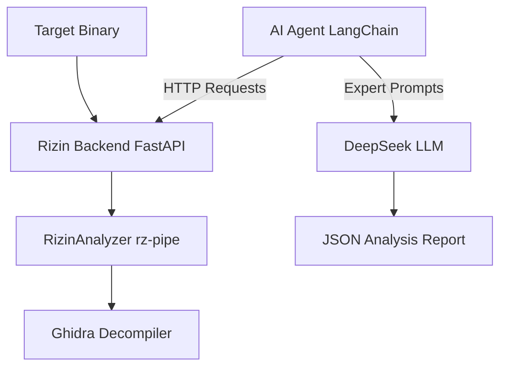

# Phantom TrojanWalker - AI 恶意软件分析框架

Phantom TrojanWalker 是一个结合了 AI (LangChain + DeepSeek) 与二进制分析工具 (Rizin) 的自动化恶意软件分析框架。它通过 Rizin 提取二进制文件的结构化信息，并利用大语言模型的专家知识进行深度威胁评估。

## 🚀 核心特性

- **AI 驱动分析**：集成 LangChain 和 DeepSeek，利用预设的专家提示词（Prompts）识别恶意行为（如进程注入、持久化、C2 通信等）。
- **二进制深度检查**：基于 `rizin` 和 `rz-ghidra` 插件，提供函数列表、字符串提取、反汇编及反编译代码分析。
- **模块化架构**：
  - **后端 (Rizin Backend)**：基于 FastAPI 的 REST API，封装了 Rizin 的分析能力。
  - **智能体 (AI Agent)**：基于 ReAct 模式的 AI 代理，自动调用后端工具获取数据并生成报告。
- **结构化报告**：自动生成 JSON 格式的分析报告，包含恶意评分、证据链及详细描述。

## 🏗 项目架构



## 🛠 环境要求

- **Python 3.10+**
- **Rizin**: 必须安装 [Rizin](https://rizin.re/) 及其 [rz-ghidra](https://github.com/rizinorg/rz-ghidra) 插件。
- **DeepSeek API Key**: 用于驱动 AI 智能体。

## 📦 安装步骤

1. **克隆仓库**：
   ```bash
   git clone https://github.com/your-repo/Phantom_TrojanWalker.git
   cd Phantom_TrojanWalker
   ```

2. **创建虚拟环境并安装依赖**：
   ```bash
   python -m venv .venv
   source .venv/bin/activate  # Windows: .venv\Scripts\activate
   pip install -r requirements.txt
   ```

3. **配置环境变量**：
   在 `agents/config.yaml` 中配置你的 API Key 和后端地址，或者根据项目需要设置 `.env` 文件。

## 🚦 使用指南

### 1. 启动 Rizin 后端服务
后端服务负责解析二进制文件并提供 API 接口。
```bash
python module/rz_pipe/main.py
```
默认运行在 `http://127.0.0.1:8000`。

### 2. 运行 AI 分析智能体
在另一个终端中运行主程序开始分析：
```bash
python agents/main.py
```

## 📂 项目结构

- `agents/`: AI 智能体核心逻辑。
  - `agent_core.py`: 定义 LangChain 代理及工具调用。
  - `config.yaml`: 配置文件（LLM 模型、API 密钥、插件地址）。
  - `prompt/`: 存放专家分析提示词模板。
- `module/rz_pipe/`: 二进制分析后端。
  - `analyzer.py`: 封装 `rzpipe` 的核心分析类。
  - `main.py`: FastAPI 服务入口。
- `requirements.txt`: 项目依赖列表。

## ⚖ 法律免责声明

本项目仅用于安全研究与教育目的。使用者需遵守当地法律法规，严禁用于任何非法用途。作者对因使用本项目导致的任何损失不承担责任。

## 🔗 参考资料

- [基于大模型的病毒木马文件云鉴定](https://mp.weixin.qq.com/s/G6LyMtzMxtwk5uAMo44euQ)
- [二进制安全新风向：AI大语言模型协助未知威胁检测与逆向分析](https://www.huorong.cn/document/info/classroom/1887)

