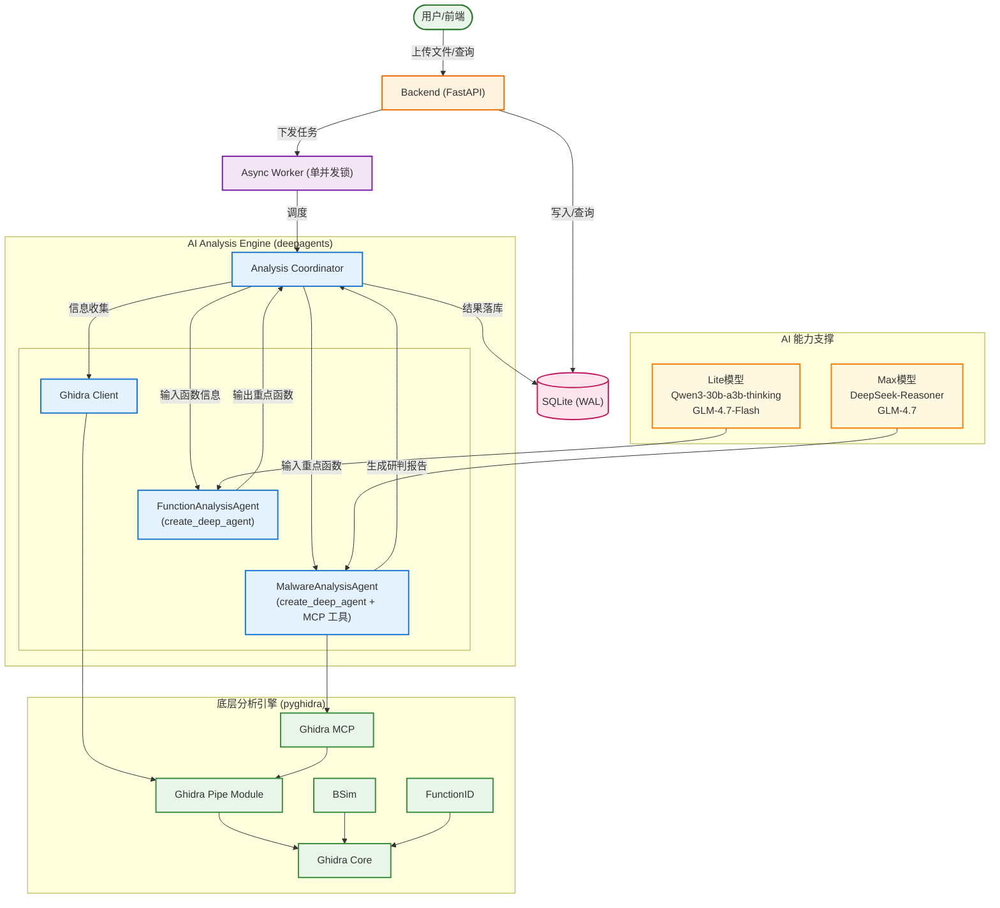

# Phantom TrojanWalker - AI 恶意软件自动化分析框架

Phantom TrojanWalker 是一个模块化的二进制分析与威胁检测平台，串联 Ghidra 静态分析、LLM 结构化研判与任务化后端，实现从样本上传到报告生成的自动化流水线。

> Agent 层基于 [deepagents](https://github.com/langchain-ai/deepagents) 框架构建，使用 Pydantic 结构化输出保证 LLM 返回可解析的 JSON，无需手动 JSON 修复。

## 🏗 系统架构


```mermaid
graph TD
    %% 定义样式
    classDef userClass fill:#e8f5e8,stroke:#2e7d32,stroke-width:2px
    classDef apiClass fill:#fff3e0,stroke:#ef6c00,stroke-width:2px
    classDef dbClass fill:#fce4ec,stroke:#c2185b,stroke-width:2px
    classDef workerClass fill:#f3e5f5,stroke:#7b1fa2,stroke-width:2px
    classDef aiClass fill:#e3f2fd,stroke:#1976d2,stroke-width:2px
    classDef binaryClass fill:#e8f5e8,stroke:#388e3c,stroke-width:2px
    classDef knowledgeClass fill:#fff8e1,stroke:#f57c00,stroke-width:2px

    %% 用户层
    User(["用户/前端"]):::userClass

    %% 后端层
    API["Backend (FastAPI)"]:::apiClass
    DB[("SQLite (WAL)")]:::dbClass
    Worker["Async Worker (单并发锁)"]:::workerClass

    %% AI 核心
    subgraph AI_Core ["AI Analysis Engine (deepagents)"]
        direction TB
        Coord["Analysis Coordinator"]:::aiClass

        subgraph Agents [" "]
            direction LR
            GhidraClient["Ghidra Client"]:::aiClass
            FAA["FunctionAnalysisAgent<br/>(create_deep_agent)"]:::aiClass
            MAA["MalwareAnalysisAgent<br/>(create_deep_agent + MCP 工具)"]:::aiClass

            GhidraClient ~~~ FAA ~~~ MAA
        end
    end

    %% 二进制引擎
    subgraph Binary_Engine ["底层分析引擎 (pyghidra)"]
        GhidraAPI["Ghidra Pipe Module"]:::binaryClass
        GhidraMCP["Ghidra MCP"]:::binaryClass
        GhidraCore["Ghidra Core"]:::binaryClass
        BSim["BSim"]:::binaryClass
        FunctionID["FunctionID"]:::binaryClass
    end

    %% 知识支撑
    subgraph Knowledge ["AI 能力支撑"]
        lite["Lite模型<br/>Qwen3-30b-a3b-thinking<br/>GLM-4.7-Flash"]:::knowledgeClass
        max["Max模型<br/>DeepSeek-Reasoner<br/>GLM-4.7"]:::knowledgeClass
    end

    %% 连接
    User -->|"上传文件/查询"| API
    API -->|"写入/查询"| DB
    API -->|"下发任务"| Worker

    Worker -->|"调度"| Coord
    Coord -->|"信息收集"| GhidraClient
    Coord -->|"输入函数信息"| FAA
    FAA -->|"输出重点函数"| Coord
    Coord -->|"输入重点函数"| MAA
    MAA -->|"生成研判报告"| Coord

    GhidraClient --> GhidraAPI
    MAA --> GhidraMCP
    GhidraMCP --> GhidraAPI
    GhidraAPI --> GhidraCore
    BSim --> GhidraCore
    FunctionID --> GhidraCore

    lite --> FAA
    max --> MAA
    Coord -->|"结果落库"| DB
```

## 🧩 目录结构

```text
├── agents/             # AI 编排层
│   ├── agent_core.py          # BaseAgent + FunctionAnalysisAgent + MalwareAnalysisAgent
│   ├── analysis_coordinator.py # 流水线编排（10 个 step 方法）
│   ├── ghidra_client.py       # Ghidra HTTP 客户端
│   ├── schemas.py             # Pydantic 结构化输出模型
│   ├── llm_factory.py         # ChatOpenAI 构造
│   ├── mcp_loader.py          # MCP 工具加载
│   ├── langfuse_utils.py      # Langfuse 追踪 + 调试日志
│   ├── config_loader.py       # YAML 配置 + 环境变量覆盖
│   ├── prompt/                # 两个 Agent 的系统提示词
│   └── config.yaml            # 实际配置（gitignored）
├── backend/            # API + 任务系统 + SQLite
│   ├── api/endpoints.py       # /api/* 路由
│   ├── worker/worker.py       # 异步队列 + 单并发锁
│   ├── models/task.py         # AnalysisTask ORM
│   ├── database.py            # SQLAlchemy (WAL)
│   ├── status.py              # 共享状态常量
│   └── core/factory.py        # 依赖注入工厂
├── frontend/           # React + Vite 看板
│   ├── src/lib/               # 共享 api.js / utils.js
│   ├── src/hooks/             # useScrollNavbar
│   ├── src/pages/             # Home / TaskDetail / History
│   ├── src/components/        # ReportView
│   └── server.mjs             # 生产静态服务 + API 代理
├── module/             # Ghidra 服务
│   ├── ghidra_pipe/           # HTTP 服务（analyzer + 6 个子模块）
│   └── ghidra_mcp/            # FastMCP 工具服务
├── docker/             # 3 个 Dockerfile
├── data/               # 上传文件 + SQLite（gitignored）
└── docker-compose.yml  # 一键启动
```

## ✅ 环境准备

- **Python**: 3.10+
- **Node.js**: 18+
- **Ghidra**: 12.0+（Docker 内置或本地安装）
- **JDK**: 21+

## ⚙️ 配置

### 1. 配置文件

复制模板并编辑：

```bash
cd agents
cp config.yaml.example config.yaml
```

`agents/config.yaml` 主要包含三部分：

- `plugins.ghidra`：Ghidra HTTP 服务地址 + 13 个 endpoint 路径映射
- `plugins.mcp`：Ghidra MCP 服务地址
- `FunctionAnalysisAgent` / `MalwareAnalysisAgent`：LLM 模型、API key、prompt 路径、限流、工具预算

完整模板见 `agents/config.yaml.example`。

### 2. LLM API Key

**使用环境变量注入（推荐，secret 不入库）**

```bash
export PTW_LLM_API_KEY="sk-..."  # 两个 Agent 共用
# 或按 Agent 单独覆盖：
export PTW_FUNCTIONANALYSISAGENT_API_KEY="sk-..."
export PTW_MALWAREANALYSISAGENT_API_KEY="sk-..."
```

环境变量优先级高于 `config.yaml`。

两个 Agent 的 `llm.max_attempts` 表示一次分析允许的最大总调用次数，包含首次调用；仅超时、连接失败、429 和 5xx 等瞬态错误会触发重试。

### 3. 模型选择建议

- **FunctionAnalysisAgent**：可用小模型（逐函数分析，并发调用）。作者用过 `mistral-medium` / `LongCat-Flash-Lite`。避免用过小的模型（如 4B），知识量不足以做 ATT&CK 矩阵匹配。
- **MalwareAnalysisAgent**：建议用先进模型（涉及工具调用 + 推理）。作者用 `LongCat-Flash-Thinking-2601`（支持边思考边调工具）。该 Agent 通过 `create_deep_agent` 创建，内置 `SummarizationMiddleware` 自动压缩上下文。

## 🚀 快速启动

### 方式 A：Docker Compose（推荐）

**前置**：填好 `agents/config.yaml`（至少 LLM api_key + 模型名）。

```bash
docker compose up --build
```

启动顺序由 `depends_on` + healthcheck 保证：`ph_ghidra` → `ph_backend` → `ph_frontend`。

默认端口（均绑定 `127.0.0.1`，仅本机访问）：

| 服务 | 端口 | 说明 |
|------|------|------|
| Ghidra Pipe | `8000` | 二进制分析 HTTP 服务 |
| Ghidra MCP | `9000` | MCP 工具服务（`/mcp`） |
| Backend | `8001` | API（`/api/*`） |
| Frontend | `8080` | 前端看板 |

访问 `http://localhost:8080`。

Docker Compose 已配置：
- `ph_ghidra`：`mem_limit: 2g`、`cpus: 1.5`、`restart: unless-stopped`、healthcheck
- `ph_backend` / `ph_frontend`：`restart: unless-stopped`、healthcheck
- 依赖方向：`ph_backend` 等 `ph_ghidra` healthy 后再启动

**国内镜像加速**（可选）：构建 ghidra 镜像时启用清华 apt 源：

```bash
docker compose build --build-arg USE_CN_MIRROR=1 ph_ghidra
```

### 方式 B：纯本地（开发调试）

需要本地已安装 Ghidra 12 + JDK 21。按顺序启动 4 个进程：

```bash
# Step 1: Ghidra MCP 工具服务（:9000）
export GHIDRA_INSTALL_DIR=/path/to/ghidra
python module/ghidra_mcp/main.py

# Step 2: Ghidra Pipe HTTP 服务（:8000）
python module/ghidra_pipe/main.py

# Step 3: Backend + Worker（:8001）
python backend/main.py

# Step 4: Frontend dev server（:5173）
cd frontend
npm install
npm run dev
```

访问 `http://localhost:5173`。前端 dev server 通过 Vite proxy 将 `/api` 转发到 `localhost:8001`。

> 本地开发时 `agents/config.yaml` 中 `plugins.ghidra.base_url` 应指向 `http://localhost:8000`，`plugins.mcp.base_url` 指向 `http://localhost:9000/mcp`。

## 🔧 环境变量参考

### 服务地址与端口

| 变量 | 作用 | 默认值 |
|------|------|--------|
| `PTW_GHIDRA_BASE_URL` | 覆盖 `plugins.ghidra.base_url` | `config.yaml` 值 |
| `PTW_MCP_BASE_URL` | 覆盖 `plugins.mcp.base_url` | `config.yaml` 值 |
| `PTW_MAX_UPLOAD_BYTES` | 最大上传大小 | `209715200` (200MB) |
| `PTW_CORS_ORIGINS` | 后端 CORS 来源（逗号分隔） | `http://localhost:5173,3000,8080` |
| `BACKEND_HOST` / `BACKEND_PORT` | 后端监听 | `0.0.0.0` / `8001` |
| `GHIDRA_PIPE_HOST` / `GHIDRA_PIPE_PORT` | ghidra_pipe 监听 | `0.0.0.0` / `8000` |
| `GHIDRA_MCP_HOST` / `GHIDRA_MCP_PORT` | ghidra_mcp 监听 | `0.0.0.0` / `9000` |

### LLM 配置（覆盖 config.yaml）

| 变量 | 作用 |
|------|------|
| `PTW_LLM_API_KEY` | 两个 Agent 共用的 API key |
| `PTW_FUNCTIONANALYSISAGENT_API_KEY` | 仅 FunctionAnalysisAgent 的 key（优先级高于共用） |
| `PTW_MALWAREANALYSISAGENT_API_KEY` | 仅 MalwareAnalysisAgent 的 key |
| `PTW_FUNCTIONANALYSISAGENT_MODEL` | 覆盖 FunctionAnalysisAgent 模型名 |
| `PTW_MALWAREANALYSISAGENT_MODEL` | 覆盖 MalwareAnalysisAgent 模型名 |

### 可观测性

| 变量 | 作用 |
|------|------|
| `PHANTOM_DEBUG` | 设为 `true` 启用抓包式调试日志，写入 `data/logs/malware_agent_debug.log` |
| `LANGFUSE_SECRET_KEY` / `LANGFUSE_PUBLIC_KEY` / `LANGFUSE_BASE_URL` | 启用 Langfuse 追踪（三个都设置才启用） |

### Ghidra 环境

| 变量 | 作用 |
|------|------|
| `GHIDRA_INSTALL_DIR` | 本地 Ghidra 安装目录（Docker 内置为 `/ghidra`） |
| `GHIDRA_MCP_ALLOW_ORIGINS` | MCP 服务 CORS 来源（默认 `*`） |
| `GHIDRA_MCP_TIMEOUT` | MCP 请求超时秒数（默认 `60`） |

### Langfuse 可观测

在项目根目录创建 `.env`：

```bash
LANGFUSE_SECRET_KEY="sk-lf-..."
LANGFUSE_PUBLIC_KEY="pk-lf-..."
LANGFUSE_BASE_URL="http://localhost:3000"
```

三个变量都设置时，LLM 调用会自动挂载 `langfuse.langchain.CallbackHandler`。未设置时自动跳过，不影响分析流程。仅需配置 backend 进程环境变量。

## 📊 数据存储

- **上传文件**：`data/uploads/<sha256>`（按内容哈希命名，自动去重）
- **任务数据库**：`data/analysis.db`（SQLite，WAL 模式）
- **结果分列存储**：`metadata_info` / `functions` / `strings` / `decompiled_code` / `function_xrefs` / `function_analyses` / `malware_report` 七个 JSON 列

`data/` 目录已 gitignored，Docker 部署时通过 `./data:/app/data` 卷挂载持久化。

## 🧷 常见问题

- **前端一直 pending**：正常队列等待。系统因 Ghidra 全局 analyzer 状态强制单并发分析（`worker._analysis_lock`），长队列时需耐心等待。
- **LLM 解析失败**：Agent 使用 Pydantic `response_format` 强制结构化输出，确认模型/网关支持 tool calling 或 structured output。
- **Ghidra 无法启动**：检查 `GHIDRA_INSTALL_DIR` 与 JDK 版本（需 21+）。
- **`config.yaml` 缺少 endpoint**：客户端会 log warning 并 fallback 到 `/<key>`，但建议保持 `config.yaml` 与 `config.yaml.example` 的 endpoints 列表一致。
- **Docker 构建慢（ghidra 镜像）**：国内用户可加 `--build-arg USE_CN_MIRROR=1` 启用清华 apt 源。

## ⚖️ 法律声明

本项目仅供安全研究与教学使用。使用者需确保在法律允许范围内使用该工具。

---

## 以上内容为人机生成，以下内容才是真人写的

我自己搭了一个站点大家可以测试：https://phantom.num123.top/

不要传加壳程序，不要传msi，不要传无关文件，更不要传函数特别多的程序

ollvm分析不了是ghidra的问题，某些样本栈不平衡也会干扰ghidra

安装包分析结果不准确，没有分析的必要

机器性能很弱，ghidra容器只分配了1个cpu核心，所以不要传很复杂的程序分析，查不到历史记录说明机器炸了

这是一个示例样本：https://phantom.num123.top/task/19f28499-a7dc-4dca-b461-a4f413f05f81

吾爱破解上有分析报告：https://www.52pojie.cn/thread-2081501-1-1.html

25年10月的样本，截止到26年3月，VT 3/70：https://www.virustotal.com/gui/file/6366946bb933e452b32e936adcc67c7c7240dbcc0f8830829dd2413c588e62cc

Phantom_TrojanWalker准确识别出完整攻击链，本项目不是开源+mcp的垃圾


最好还是自己部署，部署很方便，首先把config.yaml当中的设置填好，然后直接docker compose就行

ghidra会吃1GB左右的内存，部署的机器配置不要太低了，最好限制一下ghidra容器的CPU核心数量，否则可能会把整个机器卡死

仓库和代码都有一点乱，但是配套了copilot-instructions.md和AGENTS.md，有代码相关的问题可以直接问copilot

FunctionAnalysisAgent可以使用小模型，我用的mistral-medium + nemotron-3-nano-30b-a3b + LongCat-Flash-Lite，因为它们是免费的

不要使用太小的模型例如qwen3-4b-thinking-2507，知识太少只能理解代码的功能，不能做att&ck矩阵匹配

MalwareAnalysisAgent尽可能使用先进的模型，该agent涉及到工具调用，我使用LongCat-Flash-Thinking-2601，因为它每天送我500万tokens，并且这个模型支持一边思考一边调工具

项目还有很多优化空间，特别是提示词这块，MalwareAnalysisAgent调用工具很不积极

有问题可以提issue，有bug问copilot吧，你给我说了bug我也只会问copilot

## 局限性

真实环境中的样本往往存在大量函数需要分析，调用API非常耗费tokens，这部分我希望能够通过本地部署的小模型解决。我实测一个4b的小模型能够准确分析出代码的行为，但是由于知识量太少，做att&ck矩阵匹配比较困难。

其实逐函数分析agent的首要任务是分析代码行为，至于为什么要匹配att&ck矩阵纯粹是为了给agent一个清晰的界限，划分出哪些函数存在恶意行为需要重点关注，哪些函数没有分析的价值不需要再传递给后续的agent。至于最终匹配到的ttp精确与否完全不重要，模型只需要知道这个函数“很关键”即可。当然了，如果有精确匹配ttp的需求，大可以使用capa之类的工具按照规则去匹配。

这就像我们人工分析一个样本的流程一样，需要找到一个切入点，然后深入地挖掘，这个切入点是用什么工具或方法找出来的完全不重要。

我会尝试微调一个小模型，看看能不能让它学习到att&ck相关的知识。

另外项目还有一个缺陷就是库函数的识别，ghidra自带的bsim和fid功能很强大，但是网上的公开识别库非常少。强化库函数识别的能力，可以极大地减轻逐函数分析agent的压力。

腾讯binaryai做了库函数识别的研究，后续我也会进一步探索与尝试。

## 🔗 参考资料

- [基于大模型的病毒木马文件云鉴定](https://mp.weixin.qq.com/s/G6LyMtzMxtwk5uAMo44euQ)
- [二进制安全新风向：AI大语言模型协助未知威胁检测与逆向分析](https://www.huorong.cn/document/info/classroom/1887)

## 题外话

我是27届本科毕业生，想找一份自动化样本分析的工作，有意可联系邮箱：i_michael@qq.com