# Phantom TrojanWalker - AI 恶意软件自动化分析框架

Phantom TrojanWalker 是一个高度模块化的二进制分析与威胁检测平台。它创新性地结合了 **Rizin** 的底层逆向能力、**LangChain** 的 AI 编排能力以及 **DeepSeek** 的大规模语言模型专家知识，旨在为安全研究员提供全自动化的恶意代码审计与风险评估。

## 🚀 核心能力

- **🤖 AI 协同分析**: 集成 LangChain ReAct 模式，由 AI 智能体自主调用 Rizin 引擎获取函数、字符串、调用图等关键信息。
- **🔍 深度逆向解析**: 基于 `rizin` 和 `rz-ghidra` 插件，支持多架构反编译、符号恢复及全局调用图提取。
- **📊 任务化管理 (v2.0)**: 提供基于任务队列的异步分析模式，支持历史任务查询、SHA256 去重及状态追踪。
- **💻 现代化看板**: 基于 React + TailwindCSS + Lucide 构建的实时分析控制台，直观展示恶意评分与证据链。

## 🏗 系统架构

```mermaid
graph TD
    User((用户/前端)) -->|上传文件/查询| API[FastAPI Backend :8001]
    API -->|写入| DB[(SQLite/TaskDB)]
    API -->|下发任务| Worker[Async Worker]
    
    subgraph AI_Core [AI 分析核心]
        Worker -->|调度| Coord[Analysis Coordinator]
        Coord -->|提示词工程| LLM[DeepSeek-Reasoner]
        Coord -->|指令交互| RzClient[Rizin Client]
    end

    subgraph Binary_Engine [底层分析引擎]
        RzClient -->|HTTP/JSON| RzAPI[Rizin Backend :8000]
        RzAPI -->|rizin/rz-pipe| RzPipe[Rizin Core]
        RzPipe -->|Plugin| Ghidra[rz-ghidra Decompiler]
    end

    LLM -.->|生成报告| Worker
    Worker -->|更新状态| DB
```



## 🛠️ 环境准备

### 1. 基础环境
- **Python**: 3.10+
- **Node.js**: 18+ (用于前端构建)
- **Rizin**: 必须安装 [Rizin 核心](https://rizin.re/) 及其 [rz-ghidra](https://github.com/rizinorg/rz-ghidra) 插件。

### 2. 依赖安装
```bash
# 安装 Python 依赖
pip install -r requirements.txt

# 安装前端依赖
cd frontend
npm install
```

### 3. 配置信息
在 `agents/config.yaml` 中配置 Rizin 插件地址与两个 Agent 的 LLM 参数（字段名以代码为准，见 `agents/config_loader.py`）：
```yaml
plugins:
  rizin:
    base_url: "http://localhost:8000"
    endpoints:
      upload: "/upload"
      analyze: "/analyze"
      functions: "/functions"

FunctionAnalysisAgent:
  system_prompt_path: "prompt/FunctionAnalysisAgent.md"
  llm:
    model_name: deepseek-reasoner
    api_key: "YOUR_API_KEY_HERE"
```

提示词会在后端/worker 启动时从 `system_prompt_path` 读取；修改 prompt 后需要重启后端/worker 生效。

## 🚦 快速启动
推荐优先使用 docker-compose 启动全套服务，其次再用“纯本地三进程”调试。

### 方式 A（推荐）：Docker Compose
```bash
docker compose up --build
```
默认端口：Rizin `127.0.0.1:8000`、Backend `127.0.0.1:8001`（API 前缀 `/api`）、Frontend `127.0.0.1:8080`。

### 方式 B：纯本地（开发调试）
按顺序启动以下三个服务：

### Step 1: 启动 Rizin 底层引擎
```bash
python module/rz_pipe/main.py
# 默认监听: http://127.0.0.1:8000
```

### Step 2: 启动 分析后台 (Task Logic)
```bash
python backend/main.py
# 默认监听: http://127.0.0.1:8001
```

### Step 3: 启动 前端看板
```bash
cd frontend
npm run dev
# 默认访问: http://localhost:5173
```

后端核心 API：`POST /api/analyze`（上传并排队）+ `GET /api/tasks/{task_id}`（轮询结果）。

## 📂 目录结构

```text
├── agents/             # AI 智能体核心 (Coordinator, Tools, Prompts)
├── backend/            # 业务持久化后端 (FastAPI, SQLite, Worker)
├── frontend/           # React 前端看板
├── module/rz_pipe/     # Rizin API 封装层 (底层引擎)
├── data/               # 文件上传及任务数据存储
└── docker-compose.yml  # 一键启动（推荐）
```

## ⚖️ 法律声明

本项目仅供安全研究与教学使用。用户在使用本工具进行法律允许范围外的操作时，由此产生的法律后果由使用者本人承担。

## 🔗 参考资料

- [基于大模型的病毒木马文件云鉴定](https://mp.weixin.qq.com/s/G6LyMtzMxtwk5uAMo44euQ)
- [二进制安全新风向：AI大语言模型协助未知威胁检测与逆向分析](https://www.huorong.cn/document/info/classroom/1887)

